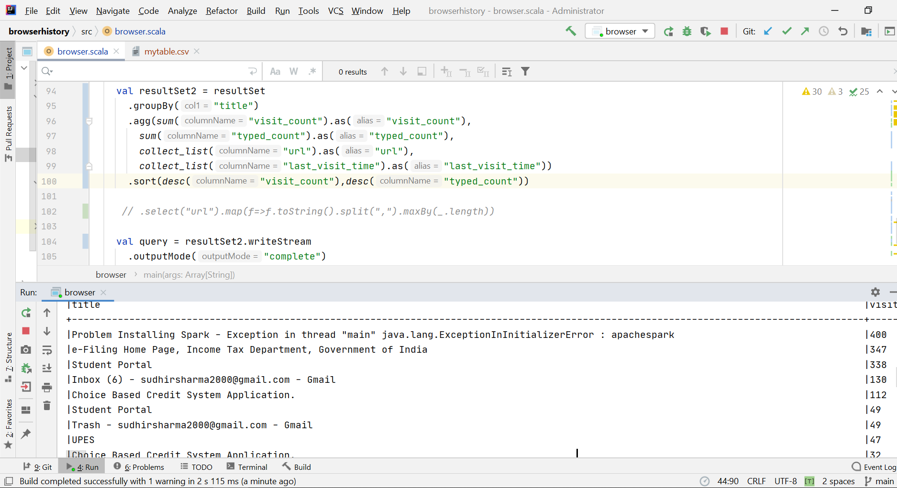

# GOOGLE CHROME BROWSER HISTORY

Google Chrome saves our internet surfing data as a sqlite3 db file on our local machines.

With this project i have tried to create an application which will live monitor the stream of my surfing history on google chrome.
To achieve this spark structured streaming API is used. Since jdbc streaming in spark streaming isn't a functionality yet hence I have connected
to the sqllite3 db via spark jdbc connector & exported the required data saved it on fly as a csv file.
This file is routinely updated every 5 mins.
Spark Streaming API later reads the csv file and provides live update to which urls have been visited the most after appling some sql operations.

This is a small utility i made for getting an insight into my Time Management.

## Google Chrome Sqlite History DB

The most relevant tables for browsing history are the "urls" table that contains all the visited URLs,
the "visits" table that contains among other information about the type of visit and the timestamps.

Hence the main query used is a combination of joining the url table &
visit table based on url id which provides a good insight into users browsing pattern.

As a proof of the work done till now , i have been working on this project hence googled a lot about spark issues faced.
Hence the below screenshot validates the same :

## Challenges Faced

- Google Local History File is locked whilst browsing ( or if any background process is running)
  
  Even if we kill the background running process and stop browsing Google chrome , live streaming wont be possible.
  Hence as a solution to this we are creating a workdirectory and copying the history db every 5 mins into the folder.
  The data from this working directory is used in the spark streaming process.
  
- Spark Streaming a JDBC Source Table/Result 
  
  Since Spark stream works on only on a file source type, kafka connection or a socket connection.
  We converted the required query result/table from the db and saved it into a temp csv format file,
  which was later read and live streamed using spark structured streaming api.

## Points of Improvement

The urls can be data mined to categorize them into broad categories for example "Research","Entertainment","Financial","Social Media".
Spark MLlib library can be used for this categorization.

Hence for any user , broad category of time spent on different urls will be visible then to better improve their time.

## References

- https://www.sans.org/blog/google-chrome-forensics/
- https://spark.apache.org/docs/latest/structured-streaming-programming-guide.html
